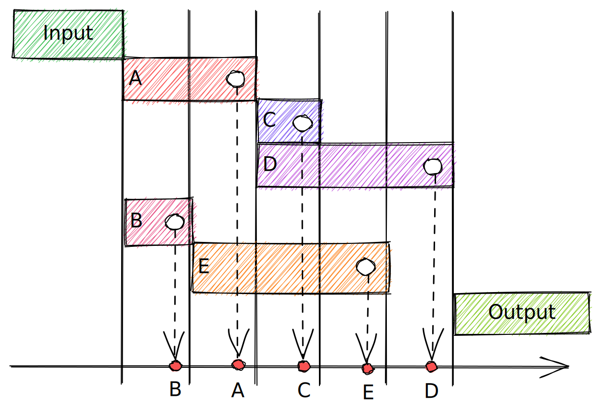

# Frunction

_Fraction of a function_

_Dependency injection in JavaScript should be easy_

Dependency-free library to handle complex async function, e.g. getServerSideProps in nextjs.

## Why

1. Do you need to split the code of a big single async function?
2. Do you want to reuse a part of async function in another one?
3. Do you want to configure dependency relation between async parts?
4. Do you want them to execute as soon as dependency is ready?

## Example

```ts
const a = depsOf([])(async () => {
  await timeout(2);
  console.log('a');
});

const b = depsOf([])(async () => {
  await timeout(1);
  console.log('b');
});

const c = depsOf([a.ref])(async () => {
  await timeout(1);
  console.log('c');
});

const d = depsOf([a.ref])(async () => {
  await timeout(3);
  console.log('d');
});

const e = depsOf([b.ref])(async () => {
  await timeout(3);
  console.log('e');
});

const fn = entryOf().consume([a, b, c, d, e]).executor();

fn();

// execution complete order
// b -> a -> c -> e -> d
```



## Another example

```ts

```

## Next.js Page Example

```ts
// pages/[...any].ts
const ctxInputRef = createRef<GetServerSideProps>();

const getServerSideProps = entryOf(ctxInput)
  .consume([
    graphqlClientFraction,
    authFraction,
  ])
  .outcome((all) => {
    return {
      props: all.reduce((props, fraction) => ({
        ...props,
        ...fraction.props,
      }), {})
    }
  })
  .catch(e => {
    if (e instanceof RedirectEx) {
      return e.build();
    } else if (e instanceof NotFoundEx) {
      return { notFound: true };
    }
    throw e;
  })
  .executor()

```

## Next.js Api Endpoint Example

```ts

const endpointFraction = depsOf([graphqlRef, authRef], async (client, auth) => {
  return await client.fetch<Thing>('some/thing.json', {
    token: auth.getToken(),
  })
});

const reqRef = createRef<NextApiRequest>();
const resRef = createRef<NextApiResponse>();

export default entryOf(reqRef, resRef)
  .consume([
    graphqlClientFraction,
    authFraction,
    endpointFraction
  ])
  // no outcome config
  .executor();
```